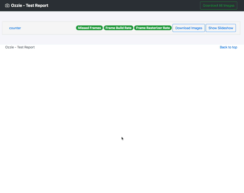

# ozzie.flutter

[](https://travis-ci.com/jorgecoca/ozzie.flutter)
[](https://codecov.io/gh/jorgecoca/ozzie.flutter)
[](https://pub.dartlang.org/packages/ozzie)


Ozzie is your testing friend. Ozzie will take an screenshot during integration tests whenever you need. Ozzie will capture performance reports for you.

## How it works

Add `ozzie` to your `pubspec.yaml` as a **dev_dependency**:

```yaml
dev_dependencies:
  ozzie: <latest_version_here>
```

In your Flutter integration tests, create an instance of `Ozzie`, pass the `FlutterDriver`, give it a `groupName` and ask it to `takeScreenshot`. That simple! And whenever you have finished with tests, you can create an HTML report by asking `Ozzie` to `generateHtmlReport`.

If you want to measure the performance of your app, simple wrap your integration tests in `profilePerformance` and it will be added to the HTML report.

Here's an example:

```dart
import 'package:flutter_driver/flutter_driver.dart';
import 'package:test/test.dart';
import 'package:ozzie/ozzie.dart';

void main() {
  FlutterDriver driver;
  Ozzie ozzie;

  setUpAll(() async {
    driver = await FlutterDriver.connect();
    ozzie = Ozzie.initWith(driver, groupName: 'counter');
  });

  tearDownAll(() async {
    if (driver != null) driver.close();
    ozzie.generateHtmlReport();
  });

  test('initial counter is 0', () async {
    await ozzie.profilePerformance('counter0', () async {
      await driver.waitFor(find.text('0'));
      await ozzie.takeScreenshot('initial_counter_is_0');
    });
  });

  test('initial counter is 0', () async {
    await ozzie.profilePerformance('counter1', () async {
      await driver.tap(find.byType('FloatingActionButton'));
      await driver.waitFor(find.text('1'));
      await ozzie.takeScreenshot('counter_is_1');
    });
  });
}
```

After this, a report will be generated inside your project as `ozzie/index.html`:



### Using ozzie.yaml to control performance thresholds

You can declare, at the root of your project, an `ozzie.yaml` file to control the different thresholds of your performance tests. If this file is not declared, `Ozzie` will use internal default values:

`ozzie.yaml`:

```yaml
integration_test_expectations:
  should_fail_build_on_warning: true
  should_fail_build_on_error: true
performance_metrics:
  missed_frames_threshold:
    warning_percentage: 5.0
    error_percentage: 10.0
  frame_build_rate_threshold:
    warning_time_in_millis: 14.0
    error_time_in_millis: 16.0
  frame_rasterizer_rate_threshold:
    warning_time_in_millis: 14.0
    error_time_in_millis: 16.0
```

### Optional screenshots

Taking screenshots can take a while, and sometimes you might want to run your integration tests without taking screenshots. If that's the case, you can set `shouldTakeScreenshots` to `false` and skip that part, saving you some precious time:

```dart
setUpAll(() async {
  driver = await FlutterDriver.connect();
  ozzie = Ozzie.initWith(
    driver,
    groupName: 'counter',
    shouldTakeScreenshots: false,
  );
});
```

## License

```
Copyright 2018 Jorge Coca

Licensed under the Apache License, Version 2.0 (the "License");
you may not use this file except in compliance with the License.
You may obtain a copy of the License at

   http://www.apache.org/licenses/LICENSE-2.0

Unless required by applicable law or agreed to in writing, software
distributed under the License is distributed on an "AS IS" BASIS,
WITHOUT WARRANTIES OR CONDITIONS OF ANY KIND, either express or implied.
See the License for the specific language governing permissions and
limitations under the License.
```
